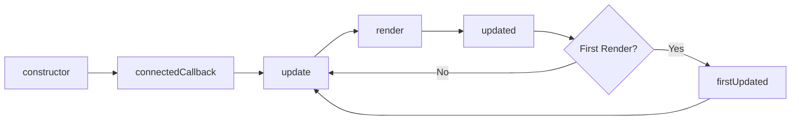

<style>
.slidev-layout :is(h1,h2,h3,h4,h5,h6) {
  font-weight: 700!important;
}
.slidev-layout h1 + p {
  opacity: 1 !important;
}
.slidev-layout .slidev-code {
  max-height: 85%;
  overflow: auto;
}
</style>

# HTML with Superpowers&nbsp;✨

Web Component Fundamentals

<div class="absolute bottom-10">
  <span class="font-700">
    Dave Rupert @davatron5000
  </span>
</div>

---

# About me

- Work: https://paravelinc.com
- App: https://luroapp.com
- Blog: https://daverupert.com
- Podcast: https://shoptalkshow.com
- YouTube: https://youtube.com/shoptalkshow
- Twitter: https://twitter.com/davatron5000
- GitHub: https://github.com/davatron5000
- CodePen: https://codepen.io/davatron5000
- Open UI: https://open-ui.org/
- Web Components CG: https://github.com/webcomponents-cg

---

# Housekeeping

- Course Links
  - Guidebook: https://htmlwithsuperpowers.netlify.app
  - Slides: https://slideswithsuperpowers.netlify.app/
- Web Component Links
  - https://web-components-cg.netlify.app/
  - https://github.com/webcomponents-cg
  - https://open-wc.org
  - https://lit.dev/
  - https://developer.mozilla.org/en-US/docs/Web/Web_Components

---

# Schedule

- 9:30AM Introduction
- 10:00AM How to use Web Components with HTML
- 11:00AM How to find off-the-shelf component libraries
- 11:30AM Coding Challenge
- 12:00PM Lunch
- 1:00PM How to style Web Components with CSS
- 2:00PM How to write custom Web Components with JS (Lit)
- 3:00PM More writing Web Components
- 4:00PM FAQ, Wrapup, and Q&A

---

# Who is this course for?

<v-clicks>

- Developers evaluating Web Components
- Developers forced to use Web Components
- People interested in Web Components
- People interested in Component Systems
- People interested in Component Systems, but really don't like JS frameworks
- Anyone who makes websites, really

</v-clicks>

<!-- - Learn what it looks like to build an entire system in Web Components
- What are the problems/constraints exist going all the way down this path?   -->
<!-- - "Help! I joined Big Company X and I need to catch up!"   -->

<!--
- Heard they were cool. 😎🆒
- You come from a strong HTML/CSS background but don't want to buy into a JS-only architecture.
-->

---
layout: statement
class: 'bg-rose-50'
---

# What are Web Components?

---
layout: quote
---

# “Web components are a set of web platform APIs that allow you to create new custom, reusable, encapsulated HTML tags to use in web pages and web apps.”  

webcomponents.org


---
layout: image
---


---
layout: items
cols: 4
---

# Lots of us use a framework to build our LEGO®

::items::

<logos-react class="text-8xl mx-auto" />
<logos-vue class="text-8xl mx-auto"/>
<logos-svelte-icon class="text-8xl mx-auto"/>
<logos-angular-icon class="text-8xl mx-auto"/>

---

# Component systems are not new


---
layout: statement
---

# What makes Web Components different?

---
layout: items
---

# Web Components are a set of Web&nbsp;Standards

::items::

<uim-cube class="text-5xl text-blue-400 mx-auto" />
<uim-layers-alt class="text-5xl text-blue-400 mx-auto" />
<uim-lock-access class="text-5xl text-blue-400 mx-auto" />
<uim-download-alt class="text-5xl text-blue-400 mx-auto" />

`<template>`  

Custom Elements  

ShadowDOM  

ES Modules  

<v-clicks>

`<slot>`

`<my-element>`

<span>"Encapsulation"</span>

<s>HTML Imports</s>

</v-clicks>

---
layout: two-cols
---

## `<template>` element

::right::

```html
<template>
   <div> HTML goes here </div>
</template>
```

---
layout: two-cols
---

## `<slot>` element

Slot elements pass content into a `<template>`. 

You can have a single slot or multiple "named" slots.

Slots also emit a `slotchanged` event when changed, which can be useful.

::right::

```html
<template>
  <div>
    <slot>
      ↪ Content revealed here
    </slot>
  </div>
</template>
```

👆 Single slot

```html
<template>
  <h1>
    <slot name="heading"></slot>
  </h1>
  <p>By <slot name="author"></slot></p>
</template>
```

👆 Mutliple slots

---
layout: two-cols
---

## Custom Elements

This is what Web Components are famous for; your own custom HTML tag.

- Must have a `-` hyphen
- Register with `customElements.define()`

::right::
```html
<custom-alert theme="warn" icon="warn">
  <strong>Breaking news</strong>
  <p>Custom attributes exist in HTML.</p>
</custom-alert>
```

```js
class CustomAlert extends HTMLElement {
  static get observedAttributes() {
    return ['theme','icon'];
  }

  constructor() {
    super();
  }

  // More JS goes here.
}

customElements.define('custom-alert', CustomAlert)
```

---
layout: two-cols
---

## Shadow DOM

"Shadow DOM" is an opaque term, but think of it as "encapsulation". Scripts and styles don't leak out and don't seep in.

Simultanously the biggest superpower ✨ and the biggest frustration.

::right::

```html
<custom-alert>
  <p>This is Light DOM content</p>
  -----------Shadow DOM-------------
  |   |
  | <slot></slot>                  |
  | <button>Close</button>         |
  ----------------------------------
</custom-alert>
```

```js
class CustomAlert extends HTMLElement {
  constructor() {
    super();
    this.attachShadow({ 
      mode: 'open'|'closed'       // default: 'closed'
      delegatesFocus: true|false  // default: false
    })
  }
}
```

---
layout: two-cols
---

## ES Modules

ES Modules bring `import` and `export` capabilities to JavaScript.

::right::

```js
import { MyButton } from 'path/to/my-button.js'

export default class HeroButton extends MyButton {
  constructor() {
    super();
    this.size = 'large';
  }
}
```

---
layout: statement
---

<style scoped>
.slidev-layout {
  color: white;
  box-shadow: inset 0 1px 85px rgba(0,0,0,0.8);
  background-image: url('https://farm9.staticflickr.com/8887/17913969678_832b1021bb_o_d.jpg');
  background-size: cover;
  background-repeat: no-repeat;
  text-shadow: 0 1px 10px rgba(0,0,0,0.9);
}
</style>

# Slow, like brisket

---
layout: items
cols: 4
---

## Who's using Web Components?

::items::

<logos-apple class="text-7xl mx-auto" />
<logos-google class="text-8xl mx-auto" />

<logos-microsoft class="text-8xl mx-auto"/>
<logos-github class="text-8xl mx-auto"/>
<logos-youtube class="text-8xl mx-auto"/>


<logos-ibm class="text-8xl mx-auto"/>
<logos-redhat class="text-8xl mx-auto"/>

<logos-salesforce class="text-8xl mx-auto"/>


---
layout: image
---

# On the rise


---

# Wordle is built with Web Components


---

# Photoshop now built with Web Components


---

# If they're so popular, why am I not using Web Components?

<v-clicks>
  
- Too low level: Designed for framework authors
- ...but framework authors didn't use them 🤦‍♂️
- There was heavy-handed advocacy from Google (Polymer, AMP)
- Confusion about the status of HTML Imports
- Didn't land in **all major browsers** until 2020 when Edge switched to Chromium.

</v-clicks>

---
layout: items
cols: 4
---

## Okay but why?

::items::

<logos-apple class="text-7xl mx-auto" />
<logos-google class="text-8xl mx-auto" />

<logos-microsoft class="text-8xl mx-auto"/>
<logos-github class="text-8xl mx-auto"/>
<logos-youtube class="text-8xl mx-auto"/>


<logos-ibm class="text-8xl mx-auto"/>
<logos-redhat class="text-8xl mx-auto"/>

<logos-salesforce class="text-8xl mx-auto"/>


---
layout: items
cols: 4
---

## Because their design systems go to more places

::items::

<logos-react class="text-7xl mx-auto" />
<logos-vue class="text-7xl mx-auto"/>
<logos-svelte-icon class="text-7xl mx-auto"/>
<logos-angular-icon class="text-7xl mx-auto"/>

<v-clicks>

<logos-ruby class="text-7xl mx-auto my-8" />
<logos-java class="text-7xl mx-auto my-8"/>
<logos-wordpress-icon class="text-7xl mx-auto my-8"/>
<logos-laravel class="text-7xl mx-auto my-8"/>

</v-clicks>

---

# Let's Recap

- Web Components are little bundles of HTML, CSS, JavaScript
- Web Components are a set of Web Standards
- Web Components are growing in usage
- Big companies are using web components on big apps
- Wordle

---
layout: intro
class: 'bg-rose-50 text-left'
---

# Using Web Components with&nbsp;HTML

---
layout: full
class: 'bg-rose-50'
---


---
layout: quote
---

# 🤔 What if we could make interactive websites without installing a bunch of JavaScript? 

---

Source: [Guardian](https://www.theguardian.com/world/2021/mar/10/japans-2011-tsunami-then-and-now-in-pictures)


---
layout: iframe-right
url: >-
  https://codepen.io/davatron5000/embed/Pobvwyx?default-tab=result
---

## `<two-up>`

Create a before/after image-panner with 5 lines of code.

```html
<two-up>
	<div></div>
	<div></div>
</two-up>

<script src="path/to/two-up.js"></script>
```


---
layout: iframe-right
url: >-
  https://codepen.io/davatron5000/embed/YzEYKwR?default-tab=result
---

## `<copy-table>`

Add copy-paste as CSV superpowers ✨ to `<table>` elements.

```html
<copy-table>
  <table>
    <!-- table rows go here -->
  </table>
</copy-table>
```


---
layout: iframe-right
url: >-
  https://codepen.io/davatron5000/embed/LYerBQw?default-tab=result
---

## `<podcast-player>`

Add specialty podcast superpowers ✨ to the native audio element.

```html
<podcast-player>
	<audio src="path/to/my.mp3" controls></audio>
</podcast-player>

<script type="module" src="path/to/podcast-player.js"></script>
```

[Demo](https://shoptalkshow.com/510/)

---
layout: iframe-right
url: >-
  https://codepen.io/davatron5000/embed/dyJKeqR?default-tab=result
---

## `<details-utils>`

A wrapper utility to add superpowers ✨ to the `<details>` element. 

```html
<details-utils close-click-outside="(min-width: 48em)" close-esc animate>
  <details id="my-details">
    <summary>My demo</summary>
    <div>
      <p>This is content</p>
    </div>
  </details>
</details-utils>

<script src="https://cdn.skypack.dev/@zachleat/details-utils" type="module"></script>  
```

---
layout: quote
---

# 🤔 Wouldn't it be great to have an bundle of premade accessible components that I could style on my own without having to install all of god's earth just to make some tabs on my website?

---
layout: fact
---

# Yes.
That's the goal.

---
layout: iframe-right
url: https://codepen.io/davatron5000/embed/oNpyEJQ?default-tab=result
---

## `<generic-components>`

[Generic Components](https://genericcomponents.netlify.app/index.html) by [Pascal Schilp](https://github.com/thepassle/) is a collection of components coded to the [WAI-ARIA Authoring Practices Guide](https://www.w3.org/TR/wai-aria-practices-1.1/). 

```html
<generic-tabs>
  <button slot="tab">About</button>
  <button slot="tab">Contact</button>
  
  <div slot="panel">About us...</div>
  <div slot="panel">Contact...</div>
</generic-tabs>
```

---
layout: iframe-right
url: https://codepen.io/davatron5000/embed/abEKYza?default-tab=result
---

## `<geo-elements>`

[Geo Elements](https://geo-elements.netlify.app/) by [Alex Riviere](https://alex.party/) library of components that relives the Web 1.0 glory days by re-implementing deprecated elements and features in a more accessible way. 

```html
<ge-blink>
  <p>I'm a blink element but I respect <code>prefers-reduced-motion</code></p>
</ge-blink>
```


---
layout: statement
---

# 😩 Ugh, none of this works in the metaverse

---
layout: iframe-right
url: >-
  https://codepen.io/davatron5000/embed/eYBaYXa?default-tab=result
---

## `<a-frame>`

Take your websites into the next dimension with 3D superpowers ✨

```html
<script src="https://aframe.io/releases/1.2.0/aframe.min.js"></script>
<a-scene>
  <a-sphere position="0 1.25 -5" radius="1.25" color="#EF2D5E"></a-sphere>
  <a-box position="-1 0.5 -3" rotation="0 45 0" width="1" height="1" depth="1" color="#4CC3D9"></a-box>
  <a-cylinder position="1 0.75 -3" radius="0.5" height="1.5" color="#FFC65D"></a-cylinder>
  <a-plane position="0 0 -4" rotation="-90 0 0" width="4" height="4" color="#7BC8A4"></a-plane>
  <a-sky color="#ECECEC"></a-sky>
</a-scene>
```

---

# Let's Recap

- ✅ Easy as HTML
- ✅ Great reusability
- ✅ Better experiences
- ✅ Progressively enhanced
- ✅ No build tools
- ✅ “Encapsulated”

---
layout: intro
class: 'bg-lime-50'
---

# Finding Web Components

---
layout: full
class: 'bg-lime-50'
---


---

<style scoped>
ul:first-of-type {
  columns: 2
}
</style>

# 😎 Awesome Standalones

I've been collecting some "standalone" Web Components that you can use in your projects today with a single script tag.

- [`<clipboard-copy>`](https://github.com/github/clipboard-copy-element)
- [`<input-knob>`](https://github.com/GoogleChromeLabs/input-knob)
- [`<lite-youtube>`](https://github.com/paulirish/lite-youtube-embed)
- [`<model-viewer>`](https://github.com/GoogleWebComponents/model-viewer)
- [`<pinch-zoom>`](https://github.com/GoogleChromeLabs/pinch-zoom)
- [`<range-slider>`](https://github.com/andreruffert/range-slider-element)
- [`<tab-container>`](https://github.com/github/tab-container-element)
- [`<task-lists>`](https://github.com/github/task-lists-element)
- [`<two-up>`](https://github.com/GoogleChromeLabs/two-up)
- [`<dark-mode-toggle>`](https://github.com/GoogleChromeLabs/dark-mode-toggle)
- [`<katex-display>` and `<katex-inline>`](https://www.npmjs.com/package/katex-elements)
- [`<html-include>`](https://www.npmjs.com/package//html-include-element)
- [`<pwa-install>`](https://github.com/pwa-builder/pwa-install)
- [`<l-i>`](https://github.com/lekoala/last-icon)
- ... More!

https://github.com/davatron5000/awesome-standalones

---

# Design Systems built with Web Components


A handful of public design systems are using Web Components in the wild.

- [Lightning Web Components](https://lwc.dev/) by Salesforce
- [Lion](https://lion-web.netlify.app/) by ING
- [PatternFly Elements](https://patternflyelements.org/) by RedHat
- [Fast](https://www.fast.design/) by Microsoft
- [Spectrum Web Components](https://opensource.adobe.com/spectrum-web-components/)  by Adobe
- [Ionic Framework](https://ionicframework.com/docs/components) by Ionic
- [Shoelace](https://shoelace.style/) by Cory LaViska
- ...More!

---
layout: section
class: 'bg-fuchsia-50'
---

# Coding Challenge 💪


---
layout: intro
class: 'bg-blue-50'
---

# Styling Web Components with&nbsp;CSS

---
layout: full
class: 'bg-blue-50'
---


---
layout: image
image: https://th.bing.com/th/id/R.4e04215ff1b24b6af13928983ae2f43c?rik=2RYtofkuHaYXlQ&riu=http%3a%2f%2fimages.techhive.com%2fimages%2farticle%2f2014%2f08%2fgameplay01-100371859-orig.jpg&ehk=vY99p0Q41xLnfW9iAo5eN15C5j2OdHfxRdNUU%2bTK4nY%3d&risl=&pid=ImgRaw&r=0
---

<style scoped>
.slidev-layout[layout="image"] h1 { 
  font-size: 6rem; 
  line-height: 1; 
  text-transform: uppercase; 
  text-shadow: 0 1px 10px rgba(0,0,0,0.8)
}
</style>
# Piercing the Shadow DOM

---

## Piercing the Shadow DOM

It can sometimes be confusing what styles pierce the Shadow Boundary.


```html
<custom-alert>
  <p>This is Light DOM</p>
  ---------Shadow Boundary----------
  |   |
  | <slot></slot>                  |
  | <button>Close</button>         |
  ----------------------------------
</custom-alert>
```

---
layout: section
---

# Styling from the outside

---
layout: section
---

# tl;dr

If you didn't write it, you can't style it.

---
layout: iframe-right
url: >-
  https://codepen.io/davatron5000/embed/BamqzVO/?default-tab=html%2Cresult
---

## Styling Light DOM? 

Can we style the HTML we wrote?

```html
button {
  background: pink;
}
```

<v-click>

<span class="absolute top-11 left-6">✅</span>

</v-click>

---
layout: iframe-right
url: >-
  https://codepen.io/davatron5000/embed/YzEJWjr/?default-tab=html%2Cresult
---

## Deep styling Shadow DOM?

What if we're really specific?

```html
example-element button {
  background: pink;
}
```

<v-click>

<span class="absolute top-11 left-6">❌</span>

</v-click>

---
layout: iframe-right
url: >-
  https://codepen.io/davatron5000/embed/KKyGMBL/?default-tab=html%2Cresult
---

## Global classes?

These should work yeah?

```html
.pink {
  background: pink;
}
```

<v-click>

<span class="absolute top-11 left-6">❌</span>

</v-click>


---
layout: iframe-right
url: >-
  https://codepen.io/davatron5000/embed/ZEaqOqY/?default-tab=result%2Cresult
---

<style scoped>
ul:first-of-type {
  font-size: 0.75rem;
  columns: 2;
  margin-top: 1rem;
}
</style>

## Inheritable Styles?

- border-collapse
- border-spacing
- caption-side
- **color**
- cursor
- direction
- empty-cells
- **font-family**
- **font-size**
- **font-style**
- font-variant
- **font-weight**
- font-size-adjust
- font-stretch
- **font**
- letter-spacing
- **line-height**
- list-style-image
- list-style-position
- list-style-type
- list-style
- orphans
- quotes
- tab-size
- **text-align**
- text-align-last
- text-decoration-color
- text-indent
- text-justify
- text-shadow
- **text-transform**
- visibility
- white-space
- widows
- word-break
- word-spacing
- word-wrap

<v-click>

<span class="absolute top-11 left-6">✅ </span>

</v-click>

---
layout: section
---

# Styling from the inside

---
layout: iframe-right
url: https://codepen.io/davatron5000/embed/GRyGBjJ?default-tab=result
---

## CSS Variables

CSS Custom Properties are also a type of inheritable style!

```css
custom-alert {
  --bg: rebeccapurple;
  --text: white;
}
```

<v-click>

<span class="absolute top-11 left-6">✅ </span>

As long as a component offers a Custom Property styling API, this may be enough to add the right amount of color and spacing customization.
  
</v-click>

---
layout: iframe-right
url:  https://codepen.io/davatron5000/embed/GRyGBqJ?default-tab=result
---

## Predefined Themes

Some components offer "themes" in the form attributes. 

```css
<custom-alert theme="warn|danger">
```

Could also control sizing or spacing.

<v-click>

<span class="absolute top-11 left-6">✅ </span>

</v-click>

---
layout: iframe-right
url: >-
  https://codepen.io/davatron5000/embed/MWrXBjr?default-tab=result
---

## Named Shadow Parts

Shadow Parts allow you to reach deep into a component and style predefined parts.

```css
custom-alert::part(button) {
  color: red;
}
```

<v-click>

<span class="absolute top-11 left-6">✅ </span>

</v-click>

---
layout: section
---

# New Shadow DOM CSS Features

---
layout: iframe-right
url: >-
  https://codepen.io/davatron5000/embed/QWaxxWe?default-tab=result
---

## `:host`

`:host` lets you target the "host" element for the Custom Element.

```css
:host p {
  background: orange;
}
```

---
layout: iframe-right
url: >-
  https://codepen.io/davatron5000/embed/jOYKKPN?default-tab=result
---

## `:host-context()`

`:host-context()` lets target the `:host` element based on its parent context.

```html
<example-element></example-element>
<div class="card">
  <example-element></example-element>
</div>
```

```css
:host-context(.card) { background:pink; }
:host-context(.card)::after { content: 'I’m in a card'; color: red; }
```

---
layout: iframe-right
url: >-
  https://codepen.io/davatron5000/embed/yLPRaWX?default-tab=result
---

## `::slotted()`

`::slotted()` lets target slotted content, but limited to one level.

```html
<example-element>
  <p>I'm pink</p>
  <div>
    <p>I'm not pink</p>
  </div>
</example-element>
```

```css
:slotted(p) {
  background: pink;
}
```


---
layout: iframe-right
url: >-
  https://codepen.io/davatron5000/embed/vYprrKa?default-tab=result
---

## `:defined`

`:defined` lets you control fallback experiences.

```html
<slow-element>This is stale content</slow-element>
```

```css
slow-element:not(:defined) {
  opacity: 0.1;
}

slow-element:defined {
  opacity: 1;
}
```

---

# Let's Recap

- External Styling
  - ✅ Styling Light DOM?
  - ❌ Deep styling Shadow DOM?
  - ❌ Global classes?
  - ✅ Inheritable styles?
- Internal Styling APIs
  - ✅ CSS Variables?
  - ✅ Predefined Themes?
  - ✅ Named Shadow Parts?
- New CSS pseudo-elements 
  - `:host` and `:host-context()`
  - `::slotted()` & `:defined`

---
layout: intro
class: 'bg-yellow-50'
---

# Writing Web Components with&nbsp;JS

---
layout: full
class: 'bg-yellow-50'
---


---
layout: two-cols
---

## The Web Component Lifecycle

::right::

```js
class CustomAlert extends HTMLElement {
  static get observedAttributes() {
    return ['icon', 'theme']
  }
  constructor() {
    super();
  }

  connectedCallback() {}    // componentDidMount
  disconnectedCallback() {} // componentWillUnmount
  attributeChangedCallback(oldValue, newValue) {}
}
customElements.define('custom-alert', CustomAlert)
```

---
layout: two-cols
---

## Injecting a template

To create Shadow DOM you need to clone a `<template>` and use its content. 

::right::

```js
const myTemplate = document.createElement('template')
myTemplate.innerHTML = `
  <div>Hello, world!</div>
`;

class CustomAlert extends HTMLElement {
  constructor() {
    super();
    this._shadowRoot = this.attachShadow({ mode: 'open' })
    this._shadowRoot.appendChild(myTemplate.content.cloneNode(true))
  }
}
```

---
layout: two-cols
---

## Putting it all together

It's getting verbose...

::right::

```js
const myTemplate = document.createElement('template')
myTemplate.innerHTML = `
  <div>Hello, world!</div>
`;

class CustomAlert extends HTMLElement {
  static get observedAttributes() {
    return ['icon', 'theme']
  }
  
  constructor() {
    super();
    this._shadowRoot = this.attachShadow({ mode: 'open' })
    this._shadowRoot.appendChild(myTemplate.content.cloneNode(true))
  }
  
  connectedCallback() {}    // componentDidMount
  disconnectedCallback() {} // componentWillUnmount
  attributeChangedCallback(oldValue, newValue) {}
}

customElements.define('custom-alert', CustomAlert)
```

---
layout: statement
---

# 😩 There's got to be a better&nbsp;way!

---
layout: quote
---

# 🤔 Hey, didn't you say Web Components were designed for framework authors?

---

# Web Component Libraries!

Typcially 5~10kb and provide a lot of convenience in small package.

At last count, there were [61 different Web Component flavors](https://webcomponents.dev/blog/all-the-ways-to-make-a-web-component/). 


---
layout: two-cols
---

## Injecting templates with&nbsp;Lit

`html` tagged templates are wonderful.

[Watch a video](https://www.youtube.com/watch?v=Io6JjgckHbg)

::right::

```js
import { LitElement, html } from 'lit'

class MyElement extends LitElement {
  constructor() {
    super();
  }

  render() {
    return html`<div>Hello, world!</div>`
  }
}
```

---
layout: two-cols
---

## Full Lit Component Lifecycle

Lit extends the native lifecycle and adds a few more intuitive hooks.

- `update`
- `updated`
- `firstUpdated`
- `render`

::right::

```js
import { LitElement, html } from 'lit'

class MyElement extends LitElement {
  constructor() {
    super();
  }
  connectedCallback() {
    super.connectedCallback();
  }
  disconnectedCallback() {
    super.disconnectedCallback();
  }
  update(changed) {
    super.update(changed);
  }
  render() {
    return html`<div></div>`
  }
  updated(changed) {
    super.updated(changed);
  }
  firstUpdated() {
    super.firstUpdated();
  }
}
```

---

# Lit Lifecycle Illustrated



---
layout: section
---

# Let's compare Web Component libraries.

---
layout: two-cols
---
# Lit

https://lit.dev/

Made by Google, old Polymer team.

::right::

```js
import { LitElement, html, css } from 'lit-element';

export class MyCounter extends LitElement {
  static properties = {
    count: { type: Number },
  };

  constructor() {
    super();
    this.count = 0;
  }

  inc() {
    this.count++;
  }

  dec() {
    this.count--;
  }

  render() {
    return html`
      <button @click="${this.dec}">-</button>
      <span>${this.count}</span>
      <button @click="${this.inc}">+</button>
    `;
  }
}

customElements.define('my-counter', MyCounter);
```

---
layout: two-cols
---
# Hybrids

https://hybrids.js.org/

Very cool, almost Svelte-like.

::right::

```js
import { html, define } from "hybrids";

function inc(host) {
  host.count++;
}

function dec(host) {
  host.count--;
}

const MyCounter = {
  tag: "my-counter",
  count: 0,
  render: ({ count }) => html`
    <button onclick="${dec}">-</button>
    <span>${count}</span>
    <button onclick="${inc}">+</button>
  `,
};

define(MyCounter);
```

---
layout: two-cols
---

# Stencil

https://stenciljs.com/

Made by Ionic, who have awesome mobile app tools.


::right::

```js
/* @jsx h */
import { Component, Prop, h, Host } from '@stencil/core';

@Component({
  tag: "my-counter",
  styleUrl: "counter.css",
  shadow: true,
})
export class MyCounter {
  @Prop() count: number = 0;

  inc() {
    this.count++;
  }

  dec() {
    this.count--;
  }

  render() {
    return (
      <Host>
        <button onClick={this.dec.bind(this)}>-</button>
        <span>{this.count}</span>
        <button onClick={this.inc.bind(this)}>+</button>
      </Host>
    );
  }
}
```

---
layout: two-cols
---

# Haunted

https://github.com/matthewp/haunted

Lit + Hooks! 👻

::right::

```js
import { html, component, useState } from "haunted";

function Counter() {
  const [count, setCount] = useState(0);

  return html`
    <button @click=${() => setCount(count - 1)}>
      -
    </button>
    <span>${count}</span>
    <button @click=${() => setCount(count + 1)}>
      +
    </button>
  `;
}

customElements.define("my-counter", component(Counter));
```

---
layout: section
---

# But... wait! There's more!

And you may not even have to switch JavaScript frameworks.


---
layout: two-cols
---

# Svelte

Probably the easiest way to do this. Svelte's compiler takes care of the rest.

::right::

```js
<svelte:options tag="my-counter" />

<script>
	let count = 0;

	function inc() {
		count++;
	}

	function dec() {
		count--;
	}
</script>

<button on:click={dec}>-</button>
<span>{count}</span>
<button on:click={inc}>+</button>
```


---
layout: two-cols
---
# Vue 3

In Vue, use `defineCustomElement` as a wrapper around your Vue component.

::right::

```js
import { defineCustomElement } from 'vue'
import MyCounter from "./my-counter.ce.vue.js";

customElements.define("my-counter", defineCustomElement(MyCounter));
```

```html
<template>
	<div>
		<button @click="dec">-</button>
		<span>{{ state.count }}</span>
		<button @click="inc">+</button>
	</div>
</template>

<script>
...
```

---
layout: two-cols
---

# Preact

Another `createCustomElement` wrapper... but also notice the `html` template literal instead of JSX.

::right::

```js
import { createCustomElement } from "@wcd/preact-custom-element";
import { Component, html } from "htm/preact";
import "preact";

...

  render(props, state) {
    return html`
      <button onClick=${this.dec}>
        -
      </button>
      <span>${state.count}</span>
      <button onClick=${this.inc}>
        +
      </button>
    `;
  }

...

customElements.define("my-counter", createCustomElement(MyCounter, ["count"]));
```

---

# Custom Elements Everywhere


---

# Let's Recap

- Web Components have a lifecycle
- Web Component libraries make writing Web Components easier
- There are lots of different flavors of Web Components
- Even some JS frameworks can import and export Web Components

---
layout: intro
class: 'bg-fuchsia-50'
---

# Coding Challenge 💪

---
layout: items
cols: 3
---

# Three examples

::items::

<uim-plus-square class="text-5xl text-blue-400 mx-auto"/>

<uim-comment class="text-5xl text-blue-400 mx-auto"/>

<mdi-beer class="text-5xl text-blue-400 mx-auto"/>

Basic Counter

Custom Alert

Brewery App


---
layout: intro
class: 'bg-slate-50'
---

# FAQ

---

# React?

**Short Answer: Yes?** And it may be getting better.

---

# Accessibile?

**Short answer: Yes.** There are a few tough spots in regards to labelling and focus behavior.

---

# IE11?

**Short answer: Yes.** There's a polyfill maintained by Google... 

...🤔 but due to the progressive enhance superpowers ✨ of Web Components, you might be possible to structure your LightDOM in such a way that it provides enough of a fallback.

Support for Internet Explorer expires on **June 15th, 2022**

---

# Reactive Contexts?

**Short Answer: Yes**, but it's BYO for now.


---

# SEO?

**Short answer: Yes.** Googlebot can flatten Shadow DOM and Light DOM.

---

# SSR?

**Short answer: Yes.** With [Declarative Shadow DOM](https://codepen.io/davatron5000/pen/PoEBezm).

---
layout: intro
class: 'bg-stone-50'
---

# Wrapping up

---
layout: statement
class: 'bg-stone-50'
---

# Web Components build into the Web Platform

---
layout: statement
class: 'bg-stone-50'
---

# Web Components can provide blueprints for richer native&nbsp;elements 

`<tabs>`, `<accordion>`, `<selectmenu>`, `<listbox>`

---
layout: statement
class: 'bg-stone-50'
---

# An easier web is a more inclusive web 

---
layout: statement
class: 'bg-stone-50'
---

# Let's build a Web for&nbsp;everyone

---
layout: section
class: 'bg-stone-50'
---

# Thanks!

Dave Rupert @davatron5000
